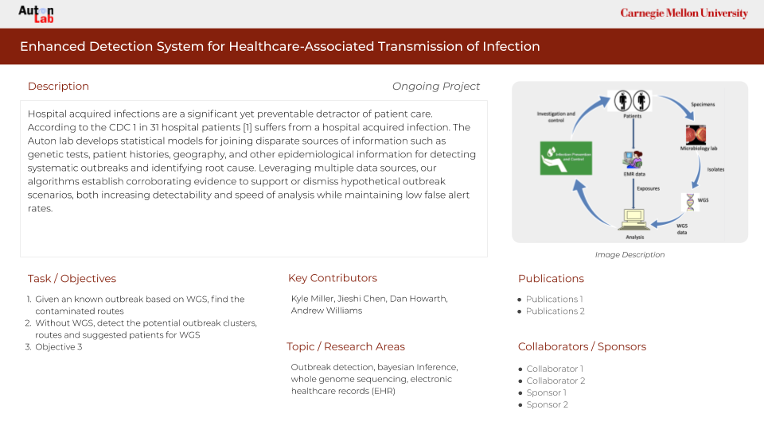
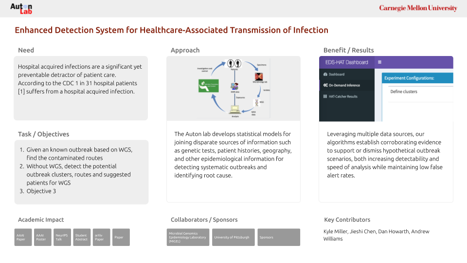
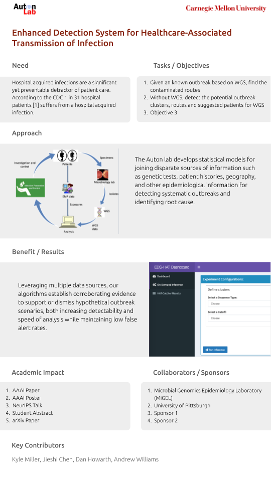

# Health Care

## Clinical Research

We use machine learning tools to build various types of practical models of data. This can range from predictive models that aim to identify some interesting aspect of patient data (e.g. is a monitor alert real or artifact, are there signs of disease or not), explanatory models (e.g. what differentiates one cohort from another, or one state from another), forecasting and trending models (e.g. what is going to happen in the future, will a patient become unstable), and grouping (or clustering) entities (e.g. these patients are similar to those ones).

* [Cardiorespiratory alert adjudication]
* [Detection of hemorrhage, parsimony of sensing modalities]
* [Differentiating hemorrhage vs sepsis]
* [Modeling resuscitation]

* [Open-heart surgery outcomes - Willa]
* [Echocardiograms - maybe - Kyle]
* [Coronary angiograms - maybe - Kyle]

* [UPMC/Pitt data collection]
* [Sepsis modeling, etc]

* [Multi-center collaboration - audata, auviewer, data collaboration schema, etc]
* [Federated learning - Sebastian]

* [Research in labelling, annotating, and making comparisons - Yichong and Chris’ work, Gus’ viewer]

* [Health insurance claims analysis]

* [Microcirculation analysis - Chao, Rob]

* [Karen has a ton of work that can be highlighted]

For each project/area slide: [Basic Research Topics], [Resources] (if applicable, e.g. applications, published standards, etc.), [Publications]

## Outbreak Detection

Hospital acquired infections are a significant yet preventable detractor of patient care. According to the CDC 1 in 31 hospital patients [1] suffers from a hospital acquired infection. The Auton lab develops statistical models for joining disparate sources of information such as genetic tests, patient histories, geography, and other epidemiological information for detecting systematic outbreaks and identifying root cause. Leveraging multiple data sources, our algorithms establish corroborating evidence to support or dismiss hypothetical outbreak scenarios, both increasing detectability and speed of analysis while maintaining low false alert rates. References [1]: https://www.cdc.gov/hai/data/index.html

(assets/ex1.pdf)
(assets/ex2.pdf)
(assets/ex3.pdf)

* [EDS-HAT Slide]

* [COVID-19]

* [CDC / Sri Lanka? - Ping Saswati or Jarod]

* [USDA - Food safety? - Ping Saswati or Jarod]

## Battlefield Healthcare

[Description]

Video: https://vimeo.com/ccmpitt/review/329391716/07ad24f9d8

In the News: https://www.cmu.edu/news/stories/archives/2019/may/trauma-care-system.html

* [TRACIR/RoboTrac/ADMIT Slide]
** Collaborators: UPMC, Biorobotics Lab
